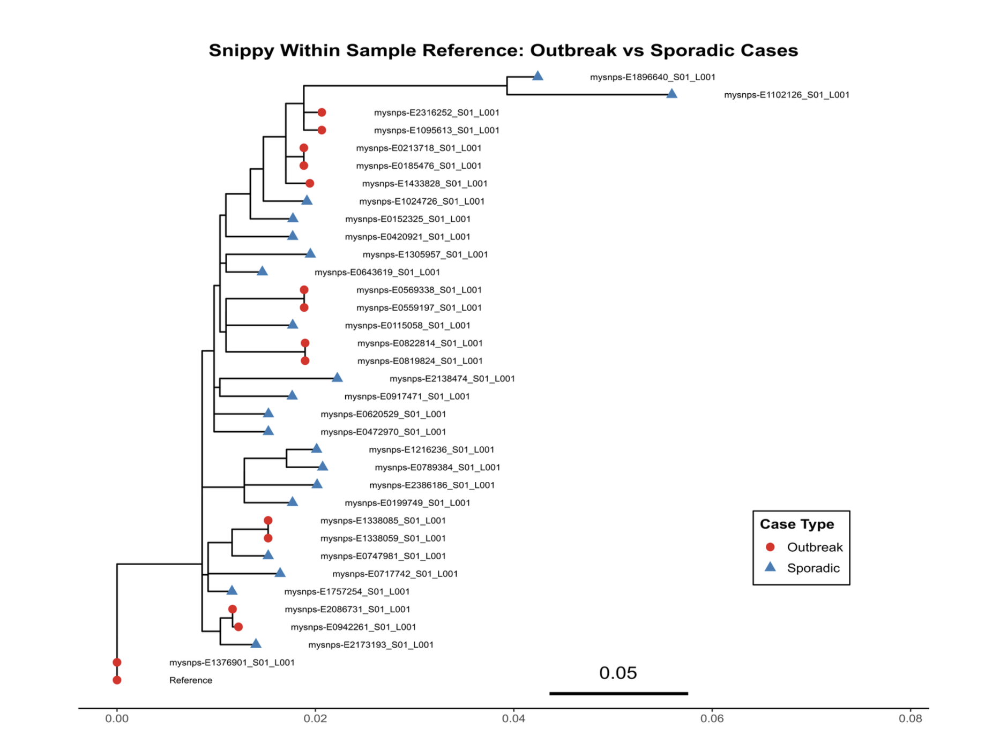
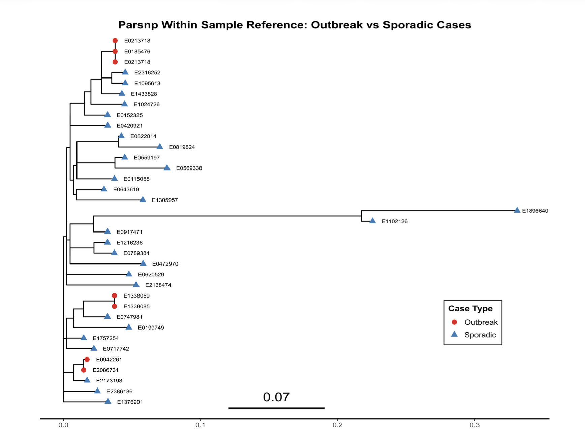

# Comparative Genomics Pipeline

Reproducible comparative genomics workflow for bacterial whole-genome sequencing, variant calling, phylogenetic analysis, and genomic clustering.

## Overview

This project analyzed 34 Campylobacter jejuni isolates to identify genomic variation and genetically related clusters. Complementary read-based and assembly-based workflows were used to compare whether different genomic analysis strategies recovered similar patterns of relatedness.

Two analytical approaches were implemented:

### Read-based workflow

FASTQ reads → fastp quality control → Snippy variant calling → core SNP alignment → IQ-TREE phylogeny → R-based distance analysis and clustering

### Assembly-based workflow

FASTQ reads → fastp quality control → SKESA genome assembly → ParSNP core-genome alignment → FastTree phylogeny → R-based distance analysis and clustering

A Nextflow DSL2 implementation was also developed for the assembly-based fastp → SKESA → ParSNP workflow.

## Key Findings

- Identified closely related multi-isolate genomic clusters and genetically distinct sporadic isolates using phylogenetic distance and hierarchical clustering.
- Evaluated both an external NCBI reference genome and a high-quality dataset-derived isolate to assess reference-dependent effects.
- Developed a Nextflow DSL2 implementation of the assembly-based workflow to improve reproducibility across multiple samples.

## Dataset

- 34 *Campylobacter jejuni* isolates
- 34 paired-end read sets (68 FASTQ files)
- 34 draft genome assemblies

Raw sequencing data are not included in this repository.

## Analysis

Pairwise evolutionary distances were calculated from the phylogenetic trees and used for hierarchical clustering. A project-defined cutoff of 0.005 substitutions per site was used to identify closely related multi-isolate clusters.

## Selected Results
Note: The original project figures use “Outbreak” for clusters defined by the project’s genetic-distance threshold. These are interpreted here as outbreak-like genomic clusters, not epidemiologically confirmed outbreaks.

### Read-based phylogeny using Snippy

Read-based core SNP phylogeny showing closely related genomic clusters and sporadic isolates identified through hierarchical clustering.



### Assembly-based phylogeny using ParSNP

Assembly-based core-genome phylogeny showing genomic relatedness across the same isolate set using the complementary ParSNP workflow.



## Tools

**Bioinformatics:** fastp, Snippy, SKESA, ParSNP, IQ-TREE, FastTree

**Programming and analysis:** Bash, R

**R packages:** ape, ggtree, ggplot2, dplyr

**Workflow and reproducibility:** Nextflow DSL2, Conda, Bioconda

**Version control:** Git, GitHub

## Project Context

This project was completed collaboratively as part of the Computational Genomics course at the Georgia Institute of Technology (Team E, Group 4). This repository presents a cleaned and reorganized version of the project workflow for portfolio and reproducibility purposes.

## Repository Structure

```text
comparative-genomics-pipeline/
├── docs/
│   └── data_description.md
├── scripts/
│   ├── read_based_pipeline.sh
│   ├── assembly_based_pipeline.sh
│   ├── snippy_tree_analysis.R
│   └── parsnp_tree_analysis.R
├── workflow/
│   ├── main.nf
│   ├── nextflow.config
│   └── environment.yml
└── README.md

